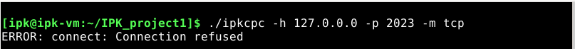

# IPK projekt 1
## Autor
[Matej Keznikl ( xkezni01 )](https://github.com/kezniklm/)
## Zadanie
Cieľom projektu bolo vytvoriť klienta pre IPK Calculator Protokol (IPKCP), ktorý komunikuje pomocou TCP alebo UDP protokolu so servermi používajúcimi protokol IPKCP.

## Implementácia 

Projekt je implementovaný v jazyku C, revízia C18 (ISO/IEC 9899:2018). Doporučuje sa prekladač **gcc verzie 7.5.0** a jeho novšie vydania.

## Použité knižnice potrebné k prekladu

* stdio.h
* stdlib.h
* string.h
* stdbool.h
* stdarg.h
* sys/socket.h
* sys/types.h
* netdb.h
* arpa/inet.h
* netinet/in.h
* unistd.h
* signal.h

## Preklad 
Preloženie projektu je možné programom GNU Make, zadaním príkazu **```make```**, pričom je nutné pred preložením projektu **```rozbaliť```** zip archív.

```
$ unzip xkezni01.zip
$ make
```

## Spustenie
Projekt je spúšťaný z príkazovej riadky, pričom prepínače je možné vzájomne zameniť.
```
$ ./ipkcpc -h <host> -p <port> -m <mode>
    -h <host>
        IPv4 adresa - identifikácia serveru ako koncového bodu komunikácie klienta
    -p <port>
        Cieľové číslo portu, ktoré musí byť v intervale <0,65535>
    -m <mode>
        Protokol používaný pre komunikáciu so serverom
```
## Príklady spustenia
```
$ ./ipkcpc -h 127.0.0.1 -p 2023 -m tcp

$ ./ipkcpc -p 65000 -m udp -h 192.168.100.1

$ ./ipkcpc -m udp -h 192.168.100.1 -p 65000
```

## Príklady použitia
```
$ ./ipkcpc -h 127.0.0.1 -p 2023 -m tcp
HELLO
HELLO
SOLVE (+ 1 2)
RESULT 3
SOLVE (+ 500 200)
RESULT 700
BYE
BYE
```
```
$ ./ipkcpc -h 147.229.176.19 -p 10002 -m udp
(+ 1 2)
OK:3
(1+1)
ERR:Could not parse the message
```

## Teoretické základy

* **IP adresa** *(Internet Protocol Address)* je číselná adresa, ktorá identifikuje zariadenie pripojené k počítačovej sieti. Každé zariadenie, ktoré je pripojené k internetu, má pridelenú **jedinečnú** IP adresu, ktorá sa skladá z dvoch častí: **adresy siete** a **adresy rozhrania**. Adresa siete označuje sieť, do ktorej zariadenie patrí, zatiaľ čo adresa rozhrania identifikuje samotné zariadenie v rámci danej siete. IP adresa sa v súčasnosti používa vo verzii **IPv4** alebo **IPv6**, kde IPv6 používa dlhšiu číselnú sekvenciu a umožňuje tak viacero možností pre pridelenie unikátnych adries [[1](#ref1)].

* **TCP** *(Transmission Control Protocol)*. Jedná sa o protokol pre spoľahlivý prenos dát v počítačových sieťach. TCP zabezpečuje, že dáta sú **správne doručené** medzi dvoma zariadeniami v sieti a že sú doručené v **správnom poradí**.
TCP funguje tak, že dáta sú rozdelené na menšie kúsky nazývané segmenty a každý segment je označený číslom sekvencie. Tieto segmenty sú potom posielané cez sieť, pričom sú overované na správnosť doručenia a poradia pomocou čísel sekvencií. TCP tiež využíva techniku nazývanú potvrdenie, ktorá zabezpečuje, že zariadenie, ktoré prijalo dáta, pošle späť potvrdenie o doručení týchto dát. Ak sa potvrdenie nevráti v určenom čase, TCP znovu pošle segment, aby zabezpečil správne doručenie [[2](#ref2)].

* **UDP** *(User Datagram Protocol)*. Jedná sa o protokol pre prenos datagramov v počítačových sieťach, ktorý poskytuje **nespoľahlivý**, **nezabezpečený** a **bezstavový** prenos dát. Oproti TCP, UDP nezabezpečuje správne doručenie dát, ich poradie ani potvrdenie doručenia, avšak vďaka týmto obmedzeniam dosahuje rýchlejší prenos dát s menšou reťazou oneskorení. Protokol UDP sa používa najmä v aplikáciách, ktoré vyžadujú rýchle prenosy dát, ako sú napríklad online hry, multimediálne streamovacie aplikácie alebo DNS (Domain Name System) servery [[2](#ref2)].


* **Port**. Port je číslo, ktoré identifikuje konkrétnu službu na zariadení pripojenom k počítačovej sieti. V TCP/IP modeli je port definovaný ako 16-bitové číslo (t.j. číslo od 0 do 65535), ktoré sa skladá z čísla portu a čísla protokolu, s ktorým je port asociovaný. Existuje množstvo preddefinovaných portov, ktoré sú asociované so štandardnými protokolmi, ako napríklad port 80 pre HTTP, port 25 pre SMTP alebo port 53 pre DNS. Okrem toho, používatelia môžu definovať aj vlastné porty pre vlastné služby [[2](#ref2)].

## Popis implementácie
* **Overenie argumentov programu** \
Program ako prvé skontroluje správnosť argumentov programu, čo zahŕňa overenie formátu vstupnej IPv4 adresy, overenie čísla portu tak aby bol v intervale <0,65535> a taktiež aby mód bol udp alebo tcp. V prípade, že bolo zadané väčšie množstvo argumentov, neexistujúci argument alebo zlý formát daného argumentu tak program skončí s chybovou hláškou podľa danej chyby.
V prípade úspešného spracovania argumentov budú argumenty uložené v štruktúre **Arguments**.
Overenie argumentov zaisťujú funkcie z **args.h** implementované v **args.c**.

* **Textový mód - TCP** \
V rámci tohoto módu sa zo štruktúry Arguments načítajú spracované argumenty a vytvorí sa socket (AF_INET). Následne sa pomocou funkcie connect() program pokúsi vytvoriť spojenie so serverom podľa informácií, ktoré užívaťeľ zadal pri spustení programu. V prípade neúspechu sa program ukončí s chybovou hláškou podľa danej chyby. Ak sa podarí programu (klientovi) úspešne vytvoreniť spojenie so serverom, môže užívateľ zadávať príkazy na príkazový riadok, ktoré program (klient) odosiela na server, pričom musí dodržiavať daný formát.
    ```
    hello = "HELLO" LF
    solve = "SOLVE" SP query LF
    result = "RESULT" SP 1*DIGIT LF
    bye = "BYE" LF
    ```
    V situácii, kedy užívateľ na klientovi stlačí CTRL + C (SIGINT), teda signál na ukončenie procesu, prípadne ak by došlo k prekročeniu veľkosti bufferu, odošle klient na server správu BYE, na ktorú mu server odpovie rovnakou správou a spojenie so serverom sa prirodzene ukončí. \
    Komunikáciu pomocou **TCP** zaisťujú funkcie z **tcp.h** implementované v **tcp.c**. 

* **Binárny mód - UDP** \
V rámci tohoto módu sa zo štruktúry Arguments načítajú spracované argumenty a vytvorí sa socket (AF_INET). Následne môže užívateľ zadávať príkazy na príkazový riadok, ktoré program (klient) odosiela na server, pričom musí dodržiavať daný formát.
    ```
    operator = "+" / "-" / "*" / "/"
    expr = "(" operator 2*(SP expr) ")" / 1*DIGIT
    ```
    Komunikáciu pomocou **UDP** zaisťujú funkcie z **udp.h** implementované v **udp.c**. 

## Testovanie
Testovanie bolo vykonávané na operačných systémoch Ubuntu a referenčnom NixOS, kde boli zdrojové súbory preložené pomocou gcc 11.3.0
* **NixOs verzie 22.11.20230221.a3d745e (Raccoon)** 
    * Testovanie argumentov programu \
    Ako prvé bolo vykonané testovanie vstupu pri spúšťaní programu
        * Testovanie správnych vstupov \
        
        
        
        * Testovanie nesprávnych vstupov
        
        
        
        
        
        
        
    * Testovanie módu TCP \
    Nasledovalo testovanie módu TCP voči referenčnému serveru na IP adrese 127.0.0.1 (localhost) pre zadané vstupy
        * Testovanie správnych vstupov
        
        
        
        
        
        
        * Testovanie nesprávnych vstupov
        
        
        
        
    * Testovanie módu UDP \
    Nasledovalo testovanie módu UDP voči referenčnému serveru na IP adrese 127.0.0.1 (localhost) pre zadané vstupy
        * Testovanie správnych vstupov
        
        
        
        * Testovanie nesprávnych vstupov
        
        
        

* **Ubuntu 22.04.2 LTS - WSL** \
    Testovanie na operačnom systéme **Ubuntu 22.04.2 LTS** prebiehalo voči serveru na IP adrese 147.229.176.19, porte 10002, ktorý sa nachádza na serveri Merlin a je dielom môjho kolegu, takže sa jednalo taktiež aj o testovanie daného serveru. Testovanie bolo vykonané s rovnakými vstupmi ako na **NixOs verzie 22.11.20230221.a3d745e (Raccoon)** pričom sa ukázalo, že všetky výstupy sú totožné. Z toho dôvodu obrázky z testovania neuvádzam.

## Zdroje
<a id="ref1"></a> [1] Kurose, J. F., & Ross, K. W. (2017). Computer Networking: A Top-Down Approach. Pearson. (Kapitola 4)

<a id="ref2"></a> [2] Kurose, J. F., & Ross, K. W. (2017). Computer Networking: A Top-Down Approach. Pearson. (Kapitola 3)

[IPK GITEA - Stubs](https://git.fit.vutbr.cz/NESFIT/IPK-Projekty/src/branch/master/Stubs/cpp)
